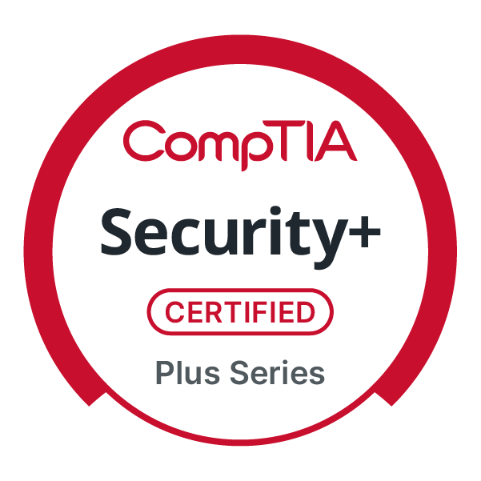

# Hi, I'm Nadine 👋🏽

## Cybersecurity Graduate | CompTIA Security+ Certified | SOC & Offensive Security 🔐

I’m an early-career cybersecurity professional with a Bachelor’s degree in Cybersecurity and CompTIA Security+ certification, building hands-on experience through academic labs, cybersecurity training, and an AI-focused internship.

I’m currently building hands-on skills across defensive and offensive security, including security monitoring, threat detection, vulnerability assessment, incident response, penetration testing, and ethical hacking. This GitHub portfolio documents my hands-on cybersecurity projects and continued professional development.

## 🛡️ Cybersecurity Skills

### Core Knowledge
Defensive / Blue Team 🔵
- SOC Analyst Investigation
- CVE Exploitation Detected
- Wireshark Traffic Analysis
- Weekly Cyber Threat Analysis

Offensive / Red Team 🔴
- Nmap Network Reconnaissance
- Web Application Penetration Test
- Metasploitable Vulnerability Assessment
- TryHackMe Penetration Testing Report

⚙️ Technical Foundations
- Linux Security Lab
- Python Port Scanner

## 🧠 Practical Skills

- Triage and investigate simulated SOC security alerts
- Analyze logs and endpoint activity for suspicious behavior
- Identify and document indicators of compromise (IOCs)
- Analyze network traffic using Wireshark
- Perform basic network and port scanning
- Use Linux command-line tools for security-focused tasks
- Develop basic Python security scripts
- Document security findings and recommend remediation actions

## 🧰 Tools & Technologies — Hands-on Exposure

- Wireshark
- Nmap
- Splunk
- Linux / Parrot Security OS
- Windows
- Python
- TryHackMe
- HackTheBox
- LetsDefend
- Virtual Machines

## 🔬 Cybersecurity Projects

### 🛡️ [SOC Analyst Investigation](https://github.com/NadineElliottCyber/SOC335-CVE-2024-49138-Investigation)
Investigated simulated security alerts, analyzed endpoint activity, identified indicators of compromise (IOCs), and documented findings and remediation recommendations.

### 🛡️ [Wazuh SIEM Home Lab](https://github.com/NadineElliottCyber/Wazuh-SIEM-Home-Lab)
Deployed and configured a Wazuh SIEM environment to monitor a Windows endpoint, analyze Windows Event Logs, investigate authentication activity, correlate security events, and map findings to MITRE ATT&CK.

### 🐍 [Python Port Scanner](https://github.com/NadineElliottCyber/Python-Port-Scanner)
Built a Python-based port scanner to identify open ports on a target system while demonstrating basic network reconnaissance, socket programming, and security automation.

## 🏆 Certifications

- **CompTIA Security+** — CompTIA | September 2026

- **[Google Cybersecurity Professional Certificate](https://coursera.org/share/baa0cdb373de604ea2ee9408dbf4b40e)** — Google | September 2026

## 🎓 Education

**Bachelor's Degree in Cybersecurity**  
Focus: Ethical Hacking

**Graduate Studies — Cybersecurity Management**

## 🎯 Current Focus

- SOC Analysis & Threat Detection
- Penetration Testing & Ethical Hacking
- Network Reconnaissance & Vulnerability Assessment
- SIEM & Log Analysis
- Incident Response
- Linux & Security Automation

## 📫 Connect With Me

I'm interested in entry-level cybersecurity, SOC analyst, security analyst, and information technology opportunities.
